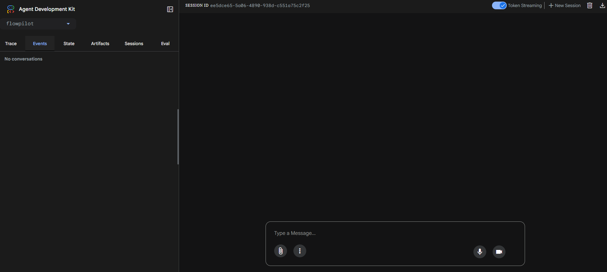
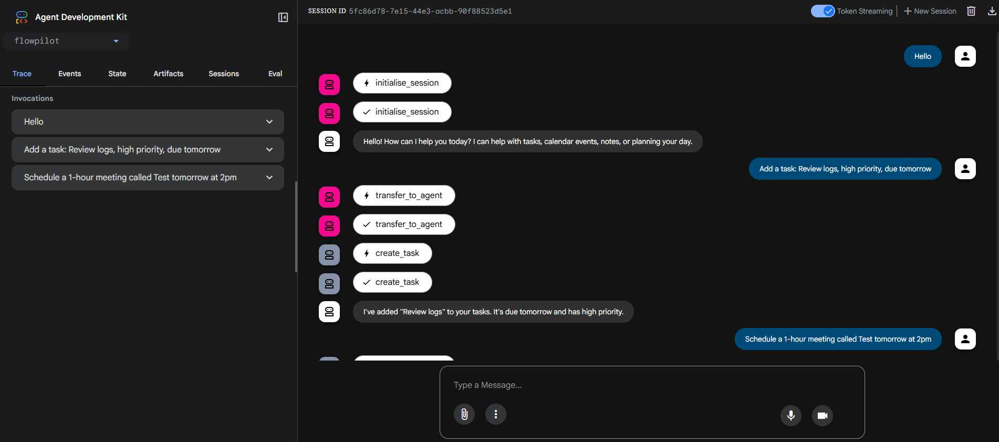
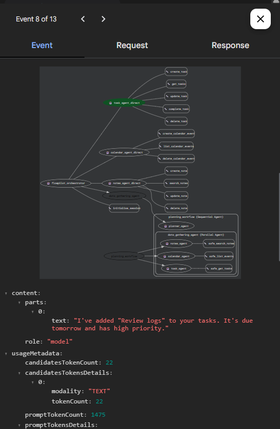

# FlowPilot 🧠

> **Multi-Agent AI Productivity System** — Google Gen AI APAC Hackathon · Stage 2

FlowPilot is a personal AI co-pilot that orchestrates specialised sub-agents to manage your tasks, calendar, notes, and daily planning through a single conversational HTTP API. Built entirely on Google's Agent Development Kit (ADK) and deployed on Cloud Run.

---

## Live Demo

> `https://flowpilot-384059006525.asia-south1.run.app`

---

## What It Does

| You say | FlowPilot does |
|--------|---------------|
| "Add a high priority task: Prepare demo, due tomorrow" | Creates task in Firestore, auto-blocks time on Google Calendar |
| "Schedule a 1-hour meeting tomorrow at 3pm" | Creates Calendar event with correct IST timezone |
| "Save a note: Client prefers async comms, SLA 24hrs" | Saves to Firestore notes collection with auto-suggested tags |
| "Plan my day" | Fetches tasks + calendar + notes **in parallel**, synthesises into a prioritised daily plan |
| "Schedule budget review Friday + create prep task by Thursday" | Routes to calendar agent AND task agent sequentially in one message |

---

## Architecture

```
HTTP POST /run  (Cloud Run · ADK endpoint)
        │
        ▼
┌─────────────────────────────────────────────────────┐
│          flowpilot_orchestrator  (Root Agent)        │
│   Routes intent · injects date · manages session     │
└──────┬──────────┬──────────┬───────────┬────────────┘
       │          │          │           │
       ▼          ▼          ▼           ▼
  task_agent  calendar_  notes_agent  planning_workflow
  _direct     agent_     _direct      (SequentialAgent)
              direct                        │
  Firestore   Google     Firestore     ┌────┴─────────────────┐
  task CRUD   Calendar   notes CRUD    │  data_gathering_agent │
                                       │    (ParallelAgent)    │
                                       │  ┌──────┬──────┬────┐ │
                                       │  │tasks │ cal  │note│ │
                                       │  └──────┴──────┴────┘ │
                                       └─────────┬─────────────┘
                                                 ▼
                                          planner_agent
                                       (synthesises plan)
```

**ADK patterns used:**

| Pattern | Where | Purpose |
|---------|-------|---------|
| `Agent` → sub-agent delegation | Root orchestrator | Intent routing |
| `SequentialAgent` | `planning_workflow` | Guarantee gather-before-plan ordering |
| `ParallelAgent` | `data_gathering_agent` | Fetch 3 data sources simultaneously |
| `output_key` / `tool_context.state` | All agents | Pass data between agents without re-querying |
| Safe wrapper functions | Planning agents | Prevent `TaskGroup` crash on partial failures |
| Date injection via `initialise_session` | Root agent tool | Eliminate model date hallucination |

---

## Project Structure

```
flowpilot/
├── __init__.py                  # ADK package entry point
├── agent.py                     # All agents, orchestration, session logic
├── tools/
│   ├── __init__.py
│   ├── task_tools.py            # Firestore CRUD: create/get/update/complete/delete tasks
│   ├── calendar_tools.py        # Google Calendar API: create/list/delete events
│   └── notes_tools.py           # Firestore CRUD: create/search/update/delete notes
├── requirements.txt
├── .env.example                 # Safe template — copy to .env
└── README.md
```
---

## 📸 Screenshots

| Initial Session Page         | Session-Started              | Events                |
| ---------------------------- | ---------------------------- | ---------------------------- |
|  |  |  |

---

## Tech Stack

| Technology | Role |
|------------|------|
| [Google ADK 1.14](https://google.github.io/adk-docs/) | Agent orchestration framework |
| [Gemini 2.5 Flash](https://cloud.google.com/vertex-ai) | LLM powering all agents via Vertex AI |
| [Google Cloud Run](https://cloud.google.com/run) | Serverless deployment, HTTP endpoint |
| [Google Cloud Firestore](https://cloud.google.com/firestore) | Tasks and notes persistence |
| [Google Calendar API](https://developers.google.com/calendar) | Event scheduling and retrieval |
| [Cloud Logging](https://cloud.google.com/logging) | Structured runtime observability |
| Python 3.12 · `uv` | Runtime and dependency management |

---

## Prerequisites

- Google Cloud project with billing enabled
- `gcloud` CLI installed and authenticated
- Python 3.11 or 3.12
- [`uv`](https://github.com/astral-sh/uv) package manager

---

## Setup & Deployment

### 1. Clone and configure environment

```bash
git clone https://github.com/YOUR_USERNAME/flowpilot.git
cd flowpilot

cp .env.example .env
# Fill in: PROJECT_ID, PROJECT_NUMBER, SERVICE_ACCOUNT, MODEL, CALENDAR_ID
```

### 2. Enable required Google Cloud APIs

```bash
source .env

gcloud services enable \
  run.googleapis.com \
  artifactregistry.googleapis.com \
  cloudbuild.googleapis.com \
  aiplatform.googleapis.com \
  firestore.googleapis.com \
  calendar-json.googleapis.com \
  compute.googleapis.com
```

### 3. Create Firestore database

```bash
gcloud firestore databases create \
  --location=asia-south1 \
  --type=firestore-native
```

### 4. Create service account and grant roles

```bash
gcloud iam service-accounts create ${SA_NAME} \
  --display-name="FlowPilot Service Account"

# Vertex AI — Gemini model access
gcloud projects add-iam-policy-binding $PROJECT_ID \
  --member="serviceAccount:$SERVICE_ACCOUNT" \
  --role="roles/aiplatform.user"

# Firestore — tasks and notes storage
gcloud projects add-iam-policy-binding $PROJECT_ID \
  --member="serviceAccount:$SERVICE_ACCOUNT" \
  --role="roles/datastore.user"

# Cloud Logging
gcloud projects add-iam-policy-binding $PROJECT_ID \
  --member="serviceAccount:$SERVICE_ACCOUNT" \
  --role="roles/logging.logWriter"
```

### 5. Share Google Calendar with the service account

1. Open [Google Calendar](https://calendar.google.com) → your calendar → **Settings**
2. **Share with specific people** → add `flowpilot-sa@YOUR_PROJECT_ID.iam.gserviceaccount.com`
3. Permission: **"Make changes to events"**
4. Copy the **Calendar ID** from "Integrate calendar" section
5. Paste it as `CALENDAR_ID=` in your `.env`

### 6. Run locally

```bash
uv venv && source .venv/bin/activate
uv pip install -r requirements.txt

# Starts the ADK dev server with UI at http://localhost:8000
adk web .
```

### 7. Deploy to Cloud Run

```bash
source .env

uvx --from google-adk==1.14.0 \
adk deploy cloud_run \
  --project=$PROJECT_ID \
  --region=asia-south1 \
  --service_name=flowpilot \
  --with_ui \
  . \
  -- \
  --labels=hackathon=apac-genai \
  --service-account=$SERVICE_ACCOUNT
```

On success, the command prints the Cloud Run URL. Save it — that's your API endpoint.

---

## API Reference

All requests: `POST https://YOUR_CLOUD_RUN_URL/run`  
Content-Type: `application/json`

### Create a task

```bash
curl -X POST https://YOUR_URL/run \
  -H "Content-Type: application/json" \
  -d '{
    "app_name": "flowpilot",
    "user_id": "user_001",
    "session_id": "sess_001",
    "new_message": {
      "role": "user",
      "parts": [{"text": "Add a high priority task: Prepare demo slides, due tomorrow, tags work and presentation"}]
    }
  }'
```

### Schedule a meeting

```bash
curl -X POST https://YOUR_URL/run \
  -H "Content-Type: application/json" \
  -d '{
    "app_name": "flowpilot",
    "user_id": "user_001",
    "session_id": "sess_002",
    "new_message": {
      "role": "user",
      "parts": [{"text": "Schedule FlowPilot Demo tomorrow at 3pm with judge@hackathon.com"}]
    }
  }'
```

### Save a note

```bash
curl -X POST https://YOUR_URL/run \
  -H "Content-Type: application/json" \
  -d '{
    "app_name": "flowpilot",
    "user_id": "user_001",
    "session_id": "sess_003",
    "new_message": {
      "role": "user",
      "parts": [{"text": "Save a note: FlowPilot ParallelAgent reduces planning latency by 60%. Tags: architecture, performance"}]
    }
  }'
```

### Get daily plan

```bash
curl -X POST https://YOUR_URL/run \
  -H "Content-Type: application/json" \
  -d '{
    "app_name": "flowpilot",
    "user_id": "user_001",
    "session_id": "sess_004",
    "new_message": {
      "role": "user",
      "parts": [{"text": "Plan my day"}]
    }
  }'
```

### Multi-domain request (calendar + task in one message)

```bash
curl -X POST https://YOUR_URL/run \
  -H "Content-Type: application/json" \
  -d '{
    "app_name": "flowpilot",
    "user_id": "user_001",
    "session_id": "sess_005",
    "new_message": {
      "role": "user",
      "parts": [{"text": "Schedule budget review Friday at 10am and create a high priority task to prepare the spreadsheet by Thursday"}]
    }
  }'
```

---

## Firestore Data Schema

```
tasks/{task_id}
  id            string
  title         string
  description   string
  due_date      string        # YYYY-MM-DD
  priority      string        # low | medium | high
  tags          array<string>
  status        string        # pending | completed
  user_id       string
  created_at    string        # ISO-8601 UTC
  updated_at    string
  completed_at  string?       # set on completion

notes/{note_id}
  id            string
  title         string
  content       string
  tags          array<string>
  user_id       string
  created_at    string
  updated_at    string
```

---

## Environment Variables

| Variable | Description | Example |
|----------|-------------|---------|
| `PROJECT_ID` | GCP project ID | `my-project-123` |
| `PROJECT_NUMBER` | GCP project number | `123456789` |
| `SA_NAME` | Service account short name | `flowpilot-sa` |
| `SERVICE_ACCOUNT` | Full SA email | `flowpilot-sa@project.iam.gserviceaccount.com` |
| `MODEL` | Gemini model name | `gemini-2.5-flash` |
| `CALENDAR_ID` | Google Calendar ID to use | `abc123@group.calendar.google.com` |

> ⚠️ Never commit `.env` — it's in `.gitignore`. Use `.env.example` as the template.

---

## Known Limitations

- **Attendees on calendar events** — Service accounts require Domain-Wide Delegation to send invites. FlowPilot stores attendee emails in the event description as a workaround.
- **Calendar scope** — Only calendars explicitly shared with the service account are accessible (`primary` personal calendars are not).
- **Session state** — Uses ADK `InMemorySessionService`; state does not persist across Cloud Run instance restarts. For production, swap to `FirestoreSessionService`.

---

## Roadmap

- [ ] Firestore-backed session persistence
- [ ] Recurring task support
- [ ] Slack / WhatsApp notification integration via MCP
- [ ] Multi-user authentication with Firebase Auth
- [ ] Web UI dashboard built on the `/run` API

---

## Built With

- [Google Agent Development Kit (ADK)](https://google.github.io/adk-docs/)
- [Gemini 2.5 Flash on Vertex AI](https://cloud.google.com/vertex-ai/generative-ai/docs/learn/models)
- [Google Cloud Firestore](https://cloud.google.com/firestore)
- [Google Calendar API v3](https://developers.google.com/calendar/api)
- [Google Cloud Run](https://cloud.google.com/run)

---

> Built by **Utkarsh Lotia** · Google Gen AI APAC Hackathon 2026